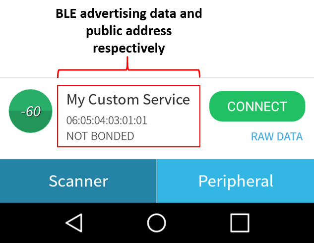
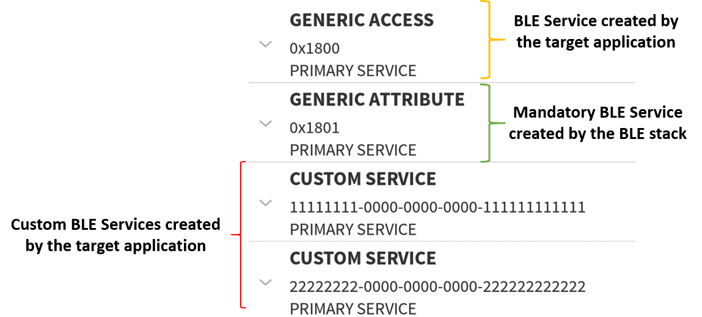
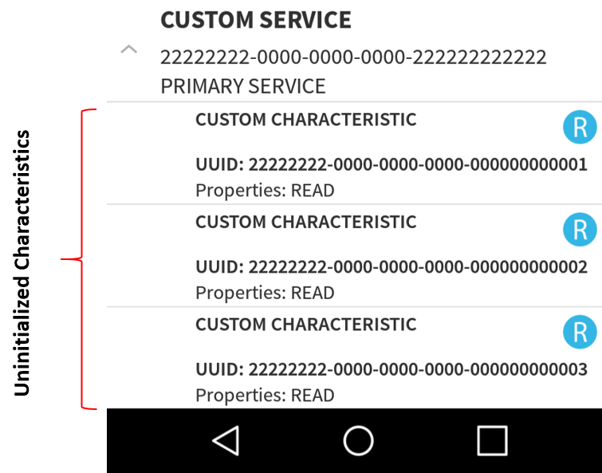
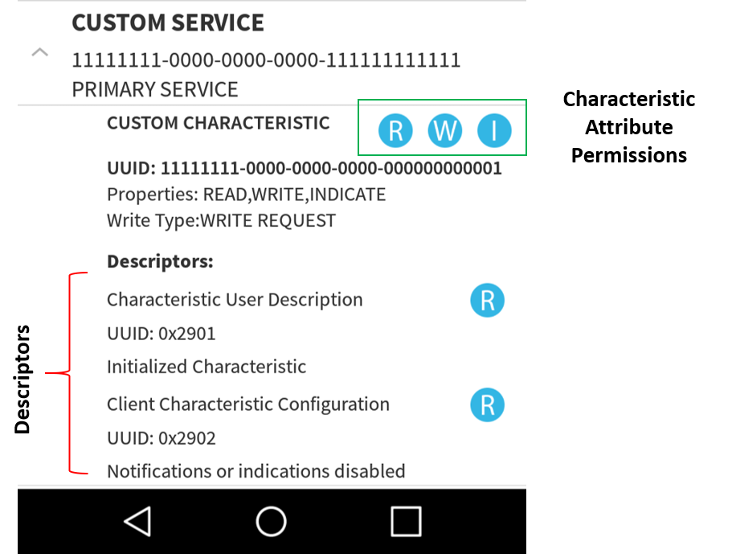
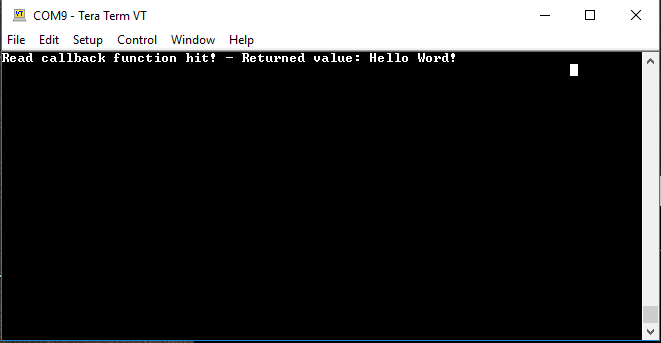
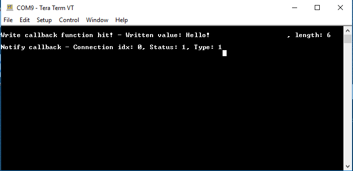
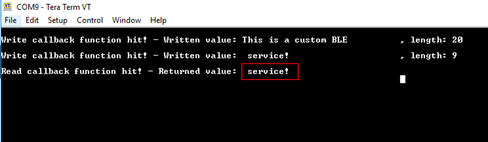

# Custom Bluetooth Services - A Dialog Custom Implementation

## Example description

This application demonstrates a sophisticated way in creating custom Bluetooth Services. The core mechanism of the application is responsible for creating, initializing and registering custom Bluetooth Services in Dialog attribute database. On top of that mechanism a friendly abstraction layer has been implemented hiding all the complexity and thus, facilitating the developer to create their services easily and quickly.

For demonstration purposes the application exhibits two custom Bluetooth Services. The first Bluetooth Service employs an initialized Characteristic Attribute, whilst the second Bluetooth Service includes three uninitialized Characteristic Attributes that can be configured as needed. The user is free to add as many Characteristic Attributes and Bluetooth Services as needed. The only limitation is the available memory space of the target device that should accommodate all the resources required for the declared Bluetooth Services.

### HW & SW Configurations

- **Hardware Configurations**
  - This example runs on a DA1469x Bluetooth Smart SoC.
  - A DA1469x Pro DevKit is needed for this example.
- **Software Configurations**
    - Download the latest SDK version (10.0.10.x)
    - **SEGGER's J-Link** tools should be downloaded and installed.

## How to run the example

### Initial Setup

- Download the source code from the Support Website.
- Import the project into your workspace.
- Connect the target device to your host PC.
- Compile the code and load it into the chip.
- Open a serial terminal (115200/8 - N - 1)
- Press the reset button on DevKit to start executing the application.
- The DA1469x module should be visible by any Bluetooth scanner APP.

Verify the Bluetooth advertising data and public address:

Press **Connect**, to connect to the peripheral device. The two custom Bluetooth Services should be displayed along with
the `Generic Access` and `Generic Attribute` Services (the last one is mandatory for all the Bluetooth devices and it is
created automatically by the Bluetooth stack):

Explore the second Bluetooth Service and verify that contains three uninitialized Characteristic Attributes:

Explore the first Bluetooth Service and verify that contains one initialized Characteristic Attribute. You can
verify its 128-bit UUID as well as its descriptors. Depending on the permission settings, the scanner App will draw the corresponding symbols. For instance, **R** for reading the Characteristic Attribute value, **W** for writing, and **N** or **I** for enabling/disabling notifications/indications respectively:

To start interacting with the peripheral device, press  **W** and in the pop-up window type a text. (e.g. Hello Word!) The written value and its size should be displayed on the serial console:

Verify the correct behavior of the Characteristic Attribute by pressing **R**. The current Characteristic Attribute value should be displayed on the serial console (this should be the last written value):

Press **I** to enable indications and try to write a new value as described previously (e.g. Hello!). The serial console should now display two messages. The first one is the written value sent to the peripheral device and the second one is the status of the notification event
sent by the peripheral device to the remote users.

**Note:** When a Characteristic Attribute is updated, the Dialog device will automatically send a notification event towards the connected peer devices. You should expect to get as many notification callback functions as the number of the connected peer devices. The only
prerequisite is for the remote device to have its notifications enabled.

**Note:** According to Bluetooth core specifications when a peer device attempts to send more than 20 bytes to the peripheral device, the `Prepare Write Request` Bluetooth event is invoked and the written value is split into chunks of 20 bytes which are sent one by one. When all data packets are received the peripheral device concatenates and provides them as a unified message. However, some scanner Apps may split the written value into chunks of 20 bytes and send them using separate write requests (without invoking a Prepare Write Request event). If this is the case, you should expect to get the following output on the serial console:

## Known Limitations

There are no known limitations for this application.
