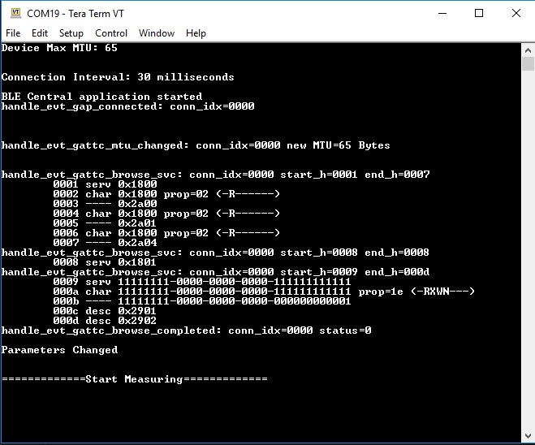

# DA1469x Power Consumption Central

______________________________________________________________________

## Example description

This application sets a DA1469x family device as BLE central. It connects to a remote device with specific bdaddress as dictated by customBLE_STATIC_ADDRESS value in ble_central_task.c file. Afterwards, the device will search for services, characteristics and descriptors which will be printed through UART.
Additionally, through altering the values of USER\_ definitions in ble_central_task.h it is possible to control the nature of the transactions that will take place between the central device and the peripheral in order to simulate scenarios that might require measurement on either the peripheral or the central.

- application implements BLE central role device.
- once the application is started, it will try to connect to a remote device.
- details of the discovered attributes are printed out to the console.
- application subscribes for notifications and indications for all characteristics that support them.
- application writes remote device name if flag CFG_UPDATE_NAME in ble_central_config.h is set.
- application waits for 30 seconds so CMAC processor's low power functions to be balanced
- application prints a message to console when it is time to start measuring and then will try to perform various scenarios as defined by the user.

## HW and SW configuration

- **Hardware configuration**

  - This example runs on The DA1469x Bluetooth Smart SoC devices.
  - The DA1469x Pro Development kit is needed for this example.
  - Connect the Development kit to the host computer.

- **Software configuration**

* This example requires:
  - Smartsnippets Studio V2.0.10
  - SDK 10.0.8.105
  * **SEGGER’s J-Link** tools should be downloaded and installed.

## How to run the example

### Initial Setup

To install the project follow the [General Installation and Debugging Procedure](http://lpccs-docs.dialog-semiconductor.com/da1469x_starting_project/index.html).

### Manual Testing

- Start advertising on a peripheral device

- start application and wait for connection complete, line "handle_evt_gap_connected: conn_idx=0000"
  will be displayed if connected

- application will display all attributes and pause for 30 seconds

- after 30 seconds a message will be displayed in console opting to start measurements

- device will start performing the chosen scenario as defined by USER\_ parameters

  

## Known Limitations

- There are no known limitations for this example. But you can check and refer to the following application note for
  [known hardware limitations](https://www.dialog-semiconductor.com/bluetooth-low-energy "known hardware limitations").
