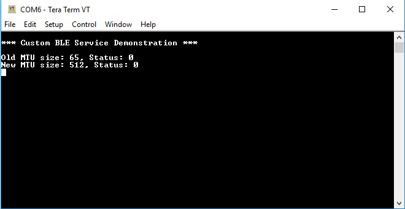

# DA1469x Power Consumption Peripheral

______________________________________________________________________

## Example description

This software example configures a DA1469x device to play the role of a peripheral device. It also creates a custom service with one characteristic of configurable size. It additionally provides the functionality of automatic value change and notify all peers with a configurable period. Most parameters that can affect power consumption are gathered in a single header file under the name **user_power_measurement_configurations.h**. This Software example is based on DA1469x Custom Bluetooth Service software example.

The purpose of this software example is to provide the means to create a peripheral suitable for power measurements while making it easy for the developer to test a variety of use cases.

### **HW & SW Configurations**

- **Hardware Configurations**
  - This example runs on a DA1469x Bluetooth Smart SoC.
  - A DA1469x Pro Development Kit is needed for this example.
- **Software Configurations**
  - SDK 10.0.8.105
  - **SEGGER's J-Link** tools should be downloaded and installed.

## How to run the example

### Initial Setup

- Download the source code from the Support Website
- Import the project into your workspace.
- Connect the target device to your host PC.
- Alter the parameters in **user_power_measurement_configurations.h** according to the chosen operation scenario.
- Compile the code (either in Release or Debug mode) and load it into the chip.
- Open a serial terminal (115200/8 - N - 1)
- Press the reset button on DA1469x daughterboard to start executing the application.

The device creates a custom service with one characteristic that allows permissions for **READ, WRITE, WRITE NO RESPONSE** and **NOTIFICATIONS/INDICATIONS** and then it starts advertising. If **USER_AUTO_UPDATE_AND_NOTIFY_EN** is enabled in **user_power_measurement_configurations.h**, it will automatically set the value of the characteristic and notify all connected peers that have requested to receive notifications, of the value change.

- ## Known Limitations

  There are no known limitations for this sample code. But you can check and refer to the following application note for [known hardware limitations](https://www.dialog-semiconductor.com/bluetooth-low-energy "known hardware limitations").
