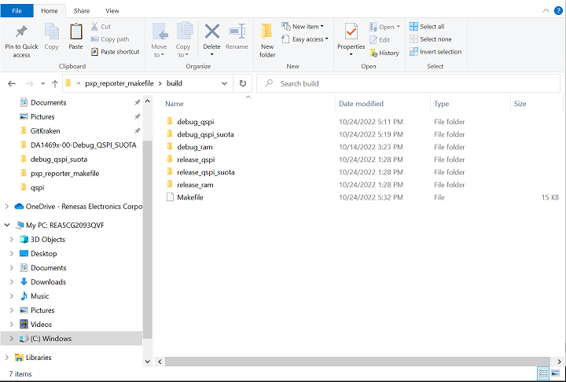
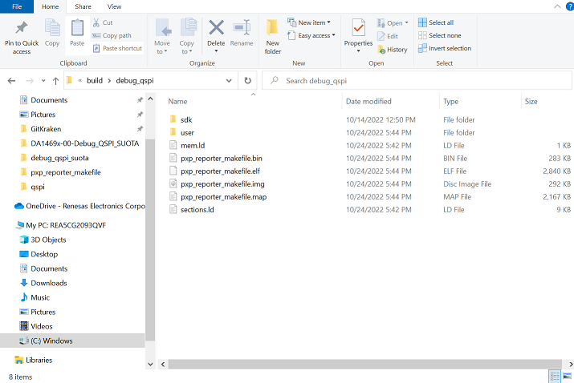

## Example description

Example makefile for SDK10 using GCC. 

This example demonstrates using a makefile to build a project from the command line, rather than relying on the Eclipse IDE to perform the necessary build steps. 
The source/project files here are a copy of the pxp_reporter sample project included with SDK10. A makefile and makefile.init file have been added to build the project and the default makefile.targets
file has been modified.


## Software configuration

- [SDK10](https://www.dialog-semiconductor.com/da1469x_sdk_latest).
- The [GNU Toolchain for ARM](https://developer.arm.com/Tools%20and%20Software/GNU%20Toolchain) should be downloaded. Note this requirement can be met by installing Smart Snippets Stuido. The [DA1469x Getting Started Guide](http://lpccs-docs.renesas.com/um-b-090-da1469x_getting_started/Software_Development_Tools/Software_Development_Tools.html#smartsnippets-tm-studio-installation-and-starting)
will walk you through the Smart Snippets Studio installation process. 
- [Python](https://www.python.org/) v3.5 or later. Note this requirement can also be met by installing Smart Snippets Studio.
 
- On Windows a Unix terminal, such as [cygwin](https://www.cygwin.com/), should be downloaded.


## How to run the example

### Compile

By default the makefile is configured run from a particular location within the SDK directory structure as depicted below.  

Example Directory Structure:

```
10.0.x.y
└───projects
│   └───dk_apps
│        └───demos
│            └───prox_reporter_makefile
│                    └───makefile.targets
│                    └───build
│                        └───makefile
│                        └───makefile.init
│
```

To build the project, the user has three options:
* This project can be moved to the appropriate position within the SDK directory structure
* The user can manually update the SOURCEROOT and APP_SOURCE_DIR variables in makefile.init
* The user can provide the appropriate paths to the SOURCEROOT and APP_SOURCE_DIR variables when calling `make`.

SOURCEROOT is the path to the top level directory of the SDK (e.g. SDK_10.0.12.146). APP_SOURCE_DIR in the path to the top level project source files (e.g. <path_on_your_machine>/prox_reporter_makefile/).

A separate build configuration is available for each of the build variants (Debug_QSPI, Debug_QSPI_SUOTA, Debug_RAM, Release_QSPI, Release_QSPI_SUOTA, Release_RAM). A user MUST specify a build configuration by setting the BUILD_CONFIG variable when calling `make` 
in order to run the default target.

Example call to build the Debug_QSPI build configuration:

```
make BUILD_CONFIG=debug_qspi
```

Example call to build Debug_QSPI build configuration with different SOURCEROOT and APP_SOURCE_DIR:

```
make BUILD_CONFIG=debug_qspi SOURCEROOT=<path_to_sdk>/SDK_10.0.12.146 APP_SOURCE_DIR=<path_to_examples_directory>/BLE_SDK10_examples/connectivity/pxp_reporter_makefile
```

Please note on Windows paths default to using a backslash (`\`) but the paths above should use a forward slash (`/`).

A separate output directory is created for each build configuration: 



For each build configuration, the top level output directory contains the primary build artifacts including the .map, .elf, and .bin files. The user may optionally change the names of these artifacts by specifying the the BUILD_ARTIFACT_NAME when building.
The sdk and user directories contain the .o and .d outputs for each file built.



To clean you have two options. To clean a specific build configuration output (e.g. Debug_QSPI) you must specify the BUILD_CONFIG when calling clean:

```
make clean BUILD_CONFIG=debug_qspi
```

If no BUILD_CONFIG is specified when calling clean, all build configurations outputs will be cleaned. 

Please note if your build requires redefining the SOURCEROOT and APP_SOURCE_DIR variables, these variables must also be defined when cleaning. 

For example for cleaning the Debug_QSPI configuration: 

```
make clean BUILD_CONFIG=debug_qspi SOURCEROOT=<path_to_sdk>/SDK_10.0.12.146 APP_SOURCE_DIR=<path_to_examples_directory>/BLE_SDK10_examples/connectivity/pxp_reporter_makefile
```

or for cleaning all configurations:


```
make clean SOURCEROOT=<path_to_sdk>/SDK_10.0.12.146 APP_SOURCE_DIR=<path_to_examples_directory>/BLE_SDK10_examples/connectivity/pxp_reporter_makefile
```

### QSPI Headers

For QSPI builds, an optional post-build step creates an .img file with the appropriate product and image headers. Please see the [DA1469x Software Platform Reference, Flash Layout](http://lpccs-docs.renesas.com/um-b-092-da1469x_software_platform_reference/User_guides/User_guides.html#flash-layout) for additional information on these headers. 

Note this step expects an .xml configuration file for your flash device already exists. One can be generated using the `<SDK_ROOT>/utilities/python_scripts/qspi/program_qspi_config.py` script provided in the SDK. The path to the .xml file is determined by the HEADER_CONFIG_XML variable.

The BUILD_CONFIG should be specified when calling the post-build target:

```
make post-build BUILD_CONFIG=debug_qspi 
```

In addition, if your build requires redefining the SOURCEROOT and APP_SOURCE_DIR variables, these variables must also be defined when running post-build:

```
make post-build BUILD_CONFIG=debug_qspi SOURCEROOT=<path_to_sdk>/SDK_10.0.12.146 APP_SOURCE_DIR=<path_to_examples_directory>/BLE_SDK10_examples/connectivity/pxp_reporter_makefile
```