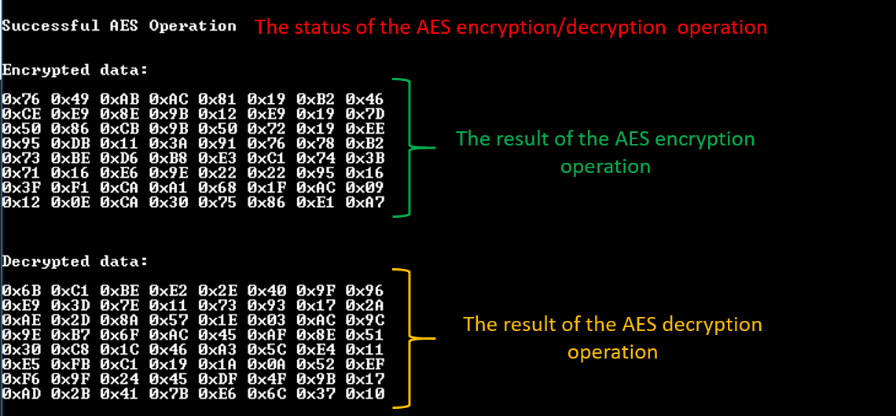
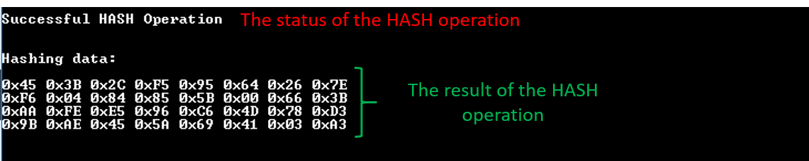

# Crypto AES/HASH Functionality

This sample code aims at demonstrating the crypto engine. The DA1469x family of devices incorporates a crypto engine capable of performing AES as well as HASH operations. Please note that the aforementioned functionalities work complementary, that is, either AES or HASH mode can be enabled at a time. A dedicated DMA engine is used for transferring data to/from TxFIFO and RxFIFO respectively. One interesting feature of the crypto engine is its ability to process fragmented data, that is, data residing at different memory locations. The sample code provides APIs that hide the complexity of utilizing the crypto engine. By default, two tasks are being created: one task responsible for demonstrating AES operations and one task responsible for HASH operations. Both of them can be enabled/disabled using the `AES_CRYPTO_ENABLE` and `HASH_CRYPTO_ENABLE` macros respectively.

### HW & SW Configurations

- **Hardware Configurations**
  - This example runs on a DA1469x Bluetooth Smart SoC.
  - A DA1469x Pro Development Kit is needed for this example.
- **Software Configurations**
  - Download the latest SDK version for the DA1469x family of devices (10.0.10)
  - **SEGGER's J-Link** tools should be downloaded and installed.

## How to run the example

### Initial Setup

- Download the source code from the Support Website
- Import the project into your workspace.
- Connect the target device to your host PC.
- Compile the code (either in Release or Debug mode) and load it into the chip.
- Open a serial terminal (115200/8 - N - 1)
- Press the reset button on DA1469x daughterboard to start executing the application.

If `SERIAL_CONSOLE_ENABLE` macro is set to one (by default enabled) you should expect to get the following output on the serial console:

&#160;&#160;

## Known Limitations

There are no known limitations for this sample code.
