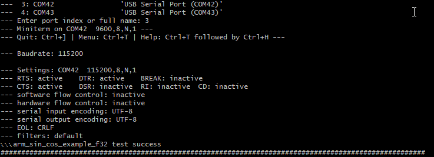

# DA1469x CMSIS DSP example

______________________________________________________________________

## Example description

This example runs the ARM CMSIS DSP library on the DA1469x. One of the example
from the CMSIS library has been extracted and used as a sanity check. This
demonstrate the right operation of the floatin point unit on the DA1469x platform.

## HW and SW configuration

- **Hardware configuration**

  - This example runs on The DA1469x Bluetooth Smart SoC devices.
  - The Pro Development kit is needed for this example.
  - Connect the Development kit to the host computer.

- **Software configuration**

  - This example requires:

  * Smartsnippets Studio 2.0.16 or newer.
  * SDK10.0.10.x

  - **SEGGER J-Link** tools should be downloaded and installed.

## How to run the example

### Initial Setup

- Compile and launch RAM target

- Use your favorite terminal to the serial port (FTDI lower index port) with the following parameters

  - baudrate: 115200
  - data: 8 bits
  - stop: 1 bit
  - parity: None
  - flow  control: none

- The terminal displays the sin_cos example has run successfully.

## Known Limitations

- There are No known limitations for this example.
