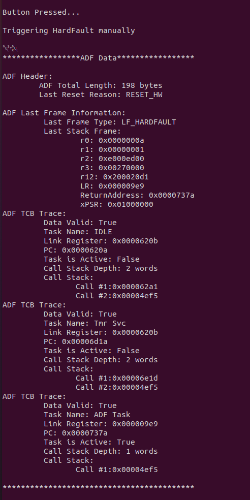
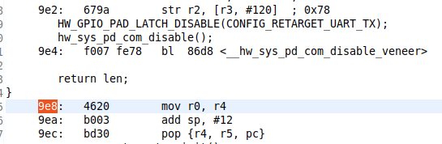
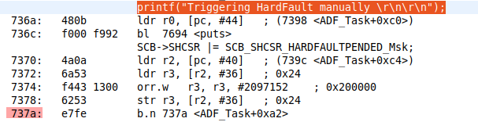
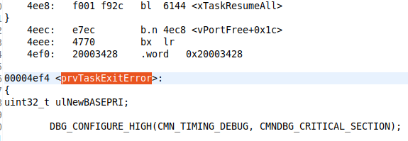

# Debug Reset Information

The goal of this application is to provide the user with a means to debug fault data in a production environment.  The ADF (Application Debug FreeRTOS) module is intended to be portable to any application. On any fault, it will capture appropriate data and report to the user meaningful information.

This module relies on uninitialized RAM, a few minor modifications to the SDK and basic unrolling of stacks to communicate to the user pertinent states of each active task.

## HW & SW Configurations

- **Hardware Configurations**
  - This example runs on a DA1469x Bluetooth Smart SoC.
  - A DA1469x Pro Development Kit or USB kit is needed for this example (KEY1_PORT and KEY1_PIN should be modified for USB Kit functionality).
- **Software Configurations**
  - Download the latest SDK version for the DA1469x family of devices (10.0.10.x)
  - **SEGGER's J-Link** tools should be downloaded and installed.

## SDK Modifications

You can apply the modification to the SDK in order to support the ADF feature by using the following command:

```console
  > cd <SDKROOT>
  > patch -p1 < <SDK_EXAMPLE_ROOT>/features/features/dlg_reset_info/sdk.patch 
```

Alternatively you can apply the modification manually

- **FreeRTOS Modifications**

  Navigate to sdk/FreeRTOS/include/task.h and at the very bottom of the include file, place the following two prototypes:

  ```c

    #if dg_configENABLE_ADF
    /*
    * Added for interrupt safe mechanism for determining stack locations
    * without exposing TCB through API
    */
    BaseType_t vTaskIsActive(TaskHandle_t xTask);

    void *vTaskGetEndOfStack(TaskHandle_t xTask);

    #endif //dg_configENABLE_ADF

  ```

  Next, navigate to sdk/FreeRTOS/src/task.c and add the functions for the prototypes above:

  ```c

    #if dg_configENABLE_ADF
    /*-----------------------------------------------------------*/
    BaseType_t vTaskIsActive(TaskHandle_t xTask)
    {

        const TCB_t * const pxTCB = ( TCB_t * ) xTask;

        if(pxTCB == pxCurrentTCB)
        {
                return pdTRUE;
        }

        return pdFALSE;

    }

    void *vTaskGetEndOfStack(TaskHandle_t xTask)
    {

        const TCB_t * const pxTCB = ( TCB_t * ) xTask;

        return pxTCB->pxEndOfStack;

    }

    #endif
  ```

- **Linker Script - Add Boot Magic Number**
  - Place the following section into section_da1469x.ld.h (sys_init_magic_num), in between hardf_fault_info and retention_mem_uninit:

  ```diff

    KEEP(\*(hard_fault_info))
  + KEEP(*(sys_init_magic_num) )
    KEEP(*(retention_mem_uninit))

  ```

- **Hardfault and NMI Handler Modifications**
  Navigate to sdk/peripherals/src/hw_hard_fault.c and declare Hardfault_HandlerC as __WEAK :

  ```c
    __WEAK void HardFault_HandlerC(unsigned long *hardfault_args)
  ```

- Navigate to sdk/peripherals/src/hw_watchdog.c and declare hw_watchdog_handle_int as weak:

  ```c

    __WEAK __RETAINED_CODE void hw_watchdog_handle_int(unsigned long *exception_args)
    {

  ```

- **Add include for adf_config.h in FreeRTOS.h**
  
  Navigate to sdk/FreeRTOS/include/FreeRTOS.h and add the following include, adf_config.h:

    ```diff

  #if (dg_configSYSTEMVIEW == 1) <br>
  #include "SEGGER_SYSVIEW_FreeRTOS.h" <br>
  #endif /*(dg_configSYSTEMVIEW == 1)*/ <br>

  + ``#if (dg_configENABLE_ADF == 1)`` <br>
  + ``#include "adf_config.h"`` <br>
  + ``#endif``

    ```

## Running the example

### Initial Setup

- Clone the Source code from Github.
- Import the project into your workspace.
- Connect the target device to your host PC.
- Compile the code (either in Release or Debug Mode)  and load it onto the chip.
- Open a serial terminal (115200, 8, N, 1)
- Press the Reset button to start the program.
- Short Press the K1 Button on the Pro Kit to trigger a HardFault condition, or long press the K1 button to trigger an NMI Fault.  
- After the fault is generated, you should see an ADF report generated at startup via Serial.



## Output Format

ADF will generate four distinct possibilities of information.  The example, as set up, uses adf_print_verbose() which will deserialize the adf serialized string and print in a human readable format.

Each piece of information is serialized in the following ADF Frame formats and can be referenced in the include/adf_types.h file:

| ADF Type  (1 byte)   | Length (uint16_t)     | Data (variable)       |
| -----------          | -----------           | -----------           |
| ADF_TYPE_HEADER      | Length of total Data  | reset_reason_t        |
| ADF_TYPE_LAST_FRAME  | Length of frame data  | adf_last_frame_info_t |
| ADF_TYPE_TCB_TRACE   | Length of tcb data    | tcb_info_t            |
| ADF_TYPE_CMAC_TRACE  | Length of cmac trace  | cmac_event_info_t     |

## Interpreting the Data

- ADF Header
  - Length 197 bytes following the Type and length bytes
  - Last reset Reason was invoked by a physical HW Reset
- ADF Last Frame
  - Last Frame Type: LF_Hardfault - Last Frame error was generated by a hardfault.
  - Last Stack Frame - Last ARM_V8 standard frame actively used by the application processor (typically aligns with the active task)
- ADF TCB Trace
  - Data Valid: True - Data is marked as valid
  - Task Name: ADF Task - ASCII Name provided at task creation
  - Link Register - LR of task
  - PC - Program Counter of task
  - Task is Active - Task was active during fault (most likely the cause of the fault)
  - Call Stack Depth - How many words for linked addresses found on the stack.
  - Call Stack - Variable output depending on depth, in this case the depth was one call.

    This project also uses a post build script to generate an objdump.txt file.  We can use this locate the addresses for the errors.  Looking at the addresses and subtracting one, we can determine this.

  - Link Register: 0x000009e9

      

      This shows the last linked address coming from the CONFIG_RETARGET module, which makes sense, as the last thing we did was printed information:

    ```c
    printf("Triggering HardFault manually \r\n\r\n");
    ```

  - Program Counter: 0x0000737a

      

      This shows the current PC pointing right to where we generated the hardfault.

  - Call #1:0x00004ef5 - Only one call on the stack, and this makes sense as the code we were last executing in the main task loop.

      

      Interpreting some of the call stack should be done with caution as this shows a stale value on the stack. prvTaskExitError() is located at the end of the FreeRTOS scheduler start.  The PC shows us in a place where the callstack should be limited.  

## Porting to Your Own Application

  1. Copy over the app_debug_freertos folder into your application.  
  2. Make required SDK modifications from above.
  3. Add the app_debug_freertos/include and app_debug_freertos/src to your include settings.
  4. In your custom_config_qspi.h file, place the ADF related defines:

      ```c

      /*****************************************************************************
      * ADF Related defines
      *****************************************************************************/
      #define dg_configENABLE_ADF                             ( 1 )
      #define dg_configFREERTOS_ENABLE_THREAD_AWARENESS       ( 1 )

      #ifdef dg_configENABLE_ADF
      #define ADDTL_UNINIT            (1024)          //Could be optimized if needed
      #else
      #define ADDTL_UNINIT            (256)
      #endif

      #define dg_configRETAINED_UNINIT_SECTION_SIZE    (ADDTL_UNINIT)

  /*****************************************************************************/  
  ```
  5. In newer SDK versions (10.0.12 and newer), tracing of the CMAC is possible.  Check that cmac_exception_ctx_ptr is declared globally, and if support is desired,  add the following #define: 
  ```
  #define CMAC_CTX_PTR_SUPPORT
  ```

  6. If you wish to generate the objdump.txt file, for easier address tracing.  Do the following:

     Right click on your project, go to C/C++ Build/Settings, then go to build steps, and in post build commands add the following arguments:

        ```console
        ${cross_prefix}${cross_objdump} -S ${ProjName}.elf > ${ProjName}_objdump.txt
        ```

  7. Call adf_tracking_init() in the main function, where you would like to start tracking tasks (before RTOS initialization will track all)


  8. In one of your application tasks, call the following two functions prior to entering the mainloop:

  ```
  adf_get_serialized_size();
  adf_get_serialized_reset_data(reset_data, &adf_actual_len, adf_length);
  ```
  9. If you wish to just print out the data, make sure ADF_PRINT() is defined and calls your print function.  If you are using CONFIG_RETARGET, make sure this is setup appropriately (use freertos_retarget as reference if not setup)

  10. Once the data is provided, the best use is to pass this over BLE back to a client side.

## Additional Notes and Limitations

  1. It's possible that a value on the call stack is not an address, but an argument.  Happens in the case where an odd value in place on the stack and aligns with an executable address.  
  2. If you get an exception for ADF_TYPE_CMAC_TRACE, please provide this data back to your local Dialog Representative.  
  