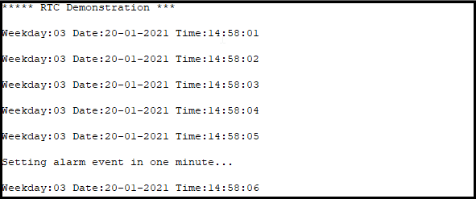
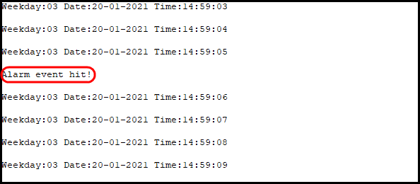

# Real-Time Clock (RTC) Demonstration

This application demonstrates using the RTC hardware block (10 ms granularity). The RTC is clocked by the low power (LP) clock used. So far, the SDK supports the `XTAL32K` crystal as LP clock. Each field of the calendar and time counter can generate an event when it rolls over. For instance, an event can be issued every new second or month. In addition, RTC supports alarm events which can be generated in two ways; as an one-time or a recurring alarm. Both alarm and and roll-over events can generate interrupts towards the ARM M33 core. In this demonstration, an interrupt is issued following a second-roll-over event. If `RTC_ENABLE_ALARM_EVENTS` macro is set (by default disabled), alarm events are enabled as well. Following an event a debugging message should be printed on the serial console.

### HW & SW Configurations

- **Hardware Configurations**
  - This example runs on a DA1469x Bluetooth Smart SoC.
  - A DA1469x Pro Development Kit is needed for this example.
- **Software Configurations**
  - Download the latest SDK version for the DA1469x family of devices (10.0.10.x).
  - **SEGGER's J-Link** tools should be downloaded and installed.

## How to run the example

### Initial Setup

- Download the source code from the Support Website
- Import the project into your workspace.
- Connect the target device to your host PC.
- Compile the code (either in Debug or Release mode) and load it into the chip.
- Open a serial terminal (115200/8 - N - 1)
- Press the reset button on DevKit to start executing the application.

Every 1 second you should expect to get the current calendar and time:

If alarm functionality is enabled, 1 minute and 5 seconds (default configuration) after code's execution you should expect to get an alarm event:

## Known Limitations

There are no known limitations for this demonstration example.
