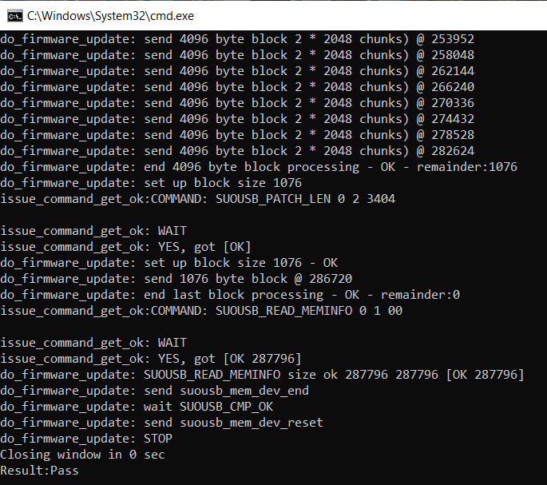
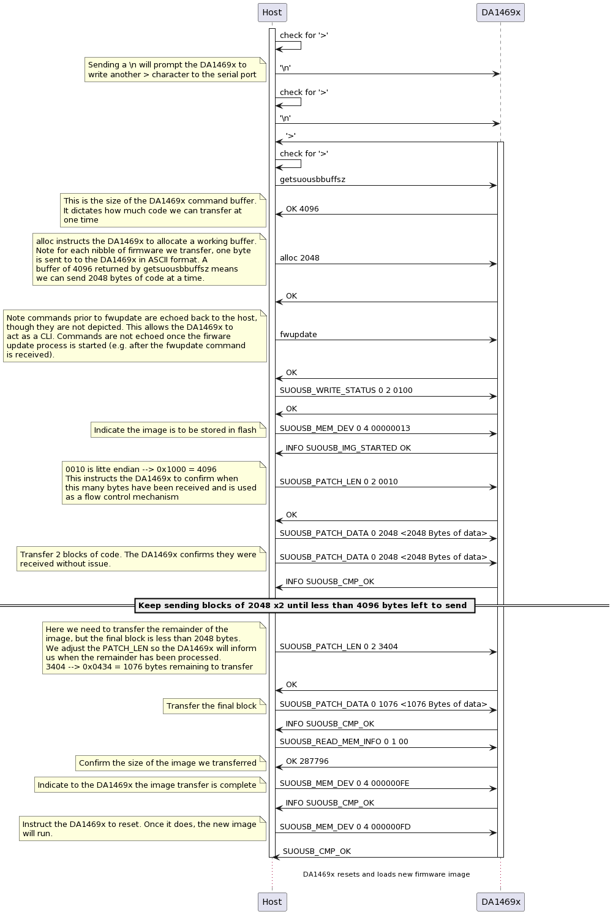

SUOUSB application {#suousb}
======================

## Example Description

This example demonstrates Software Update over USB (SUOUSB). The Pro Development Kit is used to demonstrate updating the firmware. An executable, `host_usb.exe`, is provided to run the example with a development kit connected to a PC. The source code used to create this executable is provided in `host_usb_updater.c`

## Software configuration

- [SDK10](https://www.dialog-semiconductor.com/da1469x_sdk_latest).
- [Smart Snippets Studio](https://www.renesas.com/us/en/software-tool/smartbond-development-tools) should be installed.

## Hardware Configurations

- This example runs on a DA1469x Bluetooth Smart SoC.
- A DA1469x Pro Development Kit is needed for this example.

### Prepare suousb

1. Import the project `suousb` into Smart Snippets Studio.
2. Build the project.
3. Erase flash entirely using `erase_qspi_jtag`.
4. Download `suousb` to flash using `program_qspi_jtag`.

### Create a binary that will be used to udpate firmware 

1. Import `pxp_reporter` from `<path_to_SDK>/projects/dk_apps/demos/pxp_reporter` into Smart Snippets Studio.
2. To make the flash partition table match the `suousb` project, the below define must be included.
	- #define USE_PARTITION_TABLE_4MB_WITH_SUOTA

	The build configurations for SUOTA `DA1469x-00-Release_QSPI_SUOTA` and `DA1469x-00-Debug_QSPI_SUOTA` have the define already. They can be used without any changes. 

3. Build this project with a QSPI configuration such as `DA1469x-00-Release_QSPI`, `DA1469x-00-Debug_QSPI`, `DA1469x-00-Release_QSPI_SUOTA` or `DA1469x-00-Debug_QSPI_SUOTA`.

### Add an image header to the binary

The `suousb` project is expecting a binray with a proper image header. See the [Flash Layout](http://lpccs-docs.renesas.com/um-b-092-da1469x_software_platform_reference/User_guides/User_guides.html#flash-layout) section of the Software Platform Reference for details on the image header image header format. 

To create an .img file with the proper header, you can use the mkimage.py script included with SDK10. Navigate to `<path_to_SDK>/utilities/python_scripts/suota/v11`
and open a command prompt. 

To run the script call: 

```
> python mkimage.py <path_to_build_configuration>/<binary> <path_to_build_configuration>/<output_img> -p DA1469x-00
```

For example, to run the script with the binary created in [Create a binary that will be used to udpate firmware](#create-a-binary-that-will-be-used-to-udpate-firmware) call:

```
> python mkimage.py ../../../../projects/dk_apps/demos/pxp_reporter/DA1469x-00-Release_QSPI_SUOTA/pxp_reporter.bin ../../../../projects/dk_apps/demos/pxp_reporter/DA1469x-00-Release_QSPI_SUOTA/pxp_reporter.img -p DA1469x-00
```
Note above assumes you built the `DA1469x-00-Release_QSPI_SUOTA` build configuration.

The output is an image file such as `pxp_reporter.img`.

### Run the host update script 

The first step is to connect 2 USB cables from the host PC to the Pro DK, one connected to USB1 on the Pro DK motherboard and one connected to USB connector on the Pro DK daughterboard.  

When the development kit is connected to a Windows PC, two virtual COM ports are created as described in the [Getting Started Guide](http://lpccs-docs.renesas.com/um-b-090-da1469x_getting_started/Connecting_The_Board/DA1469x_Connecting_The_Board.html#microsoft-windows). For a [Linux](http://lpccs-docs.renesas.com/um-b-090-da1469x_getting_started/Connecting_The_Board/DA1469x_Connecting_The_Board.html#linux) system, two additional devices appear under the `/dev` directory under the names `ttyUSB0` and `ttyUSB1`. The lowest of these two COM ports corresponds to the UART [logging interface](http://lpccs-docs.renesas.com/um-b-092-da1469x_software_platform_reference/Middleware/Middleware.html?highlight=config_retarget#logging) on the DA1469x.

For this example, you will see an additional third COM port (or `/dev` device for Linux) corresponding to the USB connected to the USB port of the Pro DK daughterboard. 

Reset the DA1469x  by pressing and releasing the K2(RESET) button on the daughterboard. 

The messages below are shown on the terminal of a host connected to the lowest COM port when the DA1469x is reset:

```
usb_flash_task: enter (<Date>)
usb_flash_task: prompt
```

- Open a command prompt at `<path_on_your_machine>/suousb/suousb_host`. The executable `host_usb.exe` is provided to run with the example.

- Run `host_usb.exe 40 <path_to_image_file>/pxp_reporter.1.0.0.1.img -verbose`.
	- Where `40` is the COM port associated with the USB port of the Pro DK daughterboard.
    - `<path_to_image_file>/pxp_reporter.1.0.0.1.img` is the path to the image file you created above
	- Debug message can be enabled with the `-verbose` option.

- Once the script finishes it will indicate the result (e.g Result: Pass): 



Once the update process has completed successfully, the DA1469x will reset and start advertising the `pxp_reporter` application. 


Please note the `pxp_reporter` built above did not include a `suousb` implementation, so the `host_usb.exe` script cannot be run again once `pxp_reporter` has been downloaded. To enable updating with `suousb` once your image is donwloaded, the `suousb` code must be integrated into your project.

### Command Flow Overview

The below sequence diagram provides of an overview of the commands/responses exchanged between the `host_usb.exe` script running on the PC and the DA1469x running `suousb`. 

