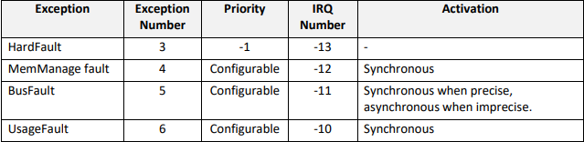
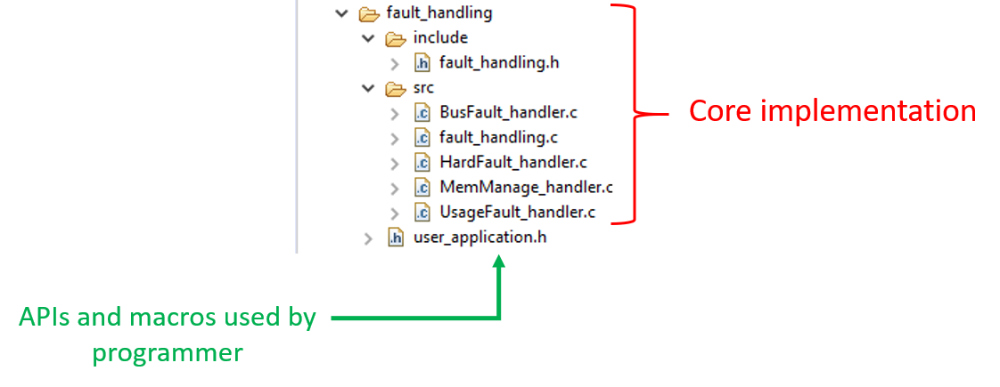
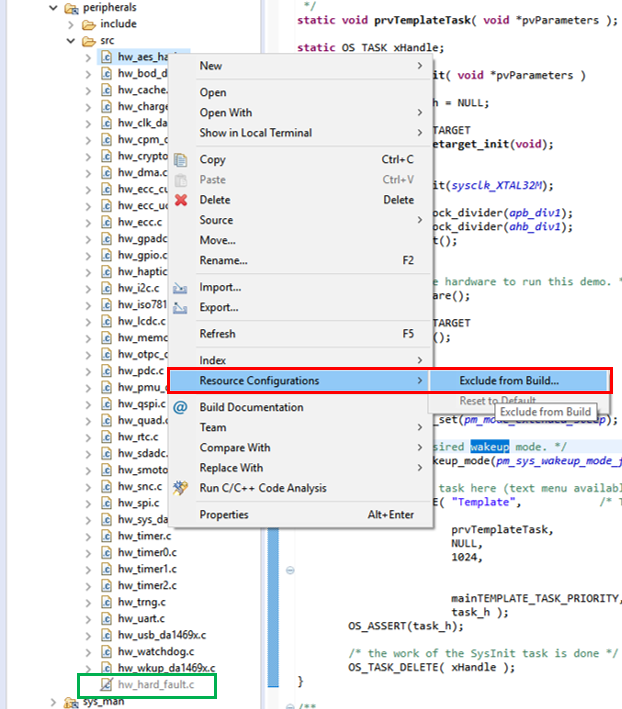
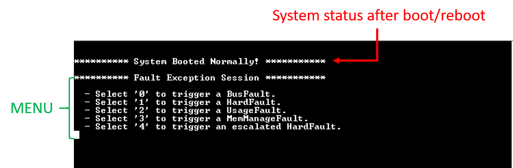
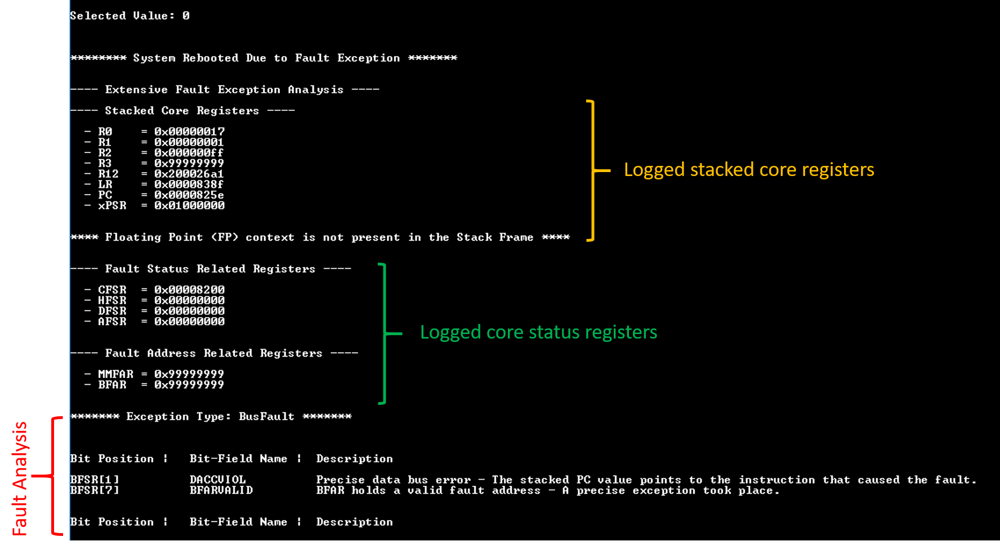
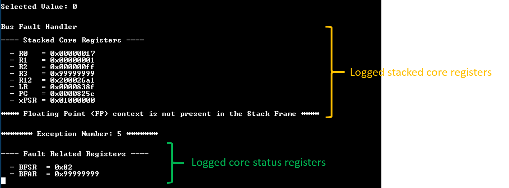

# M33 Fault Handling

## Example Description

This example code aims to demonstrate best practices on how to deal with fault exceptions on ARM-Cortex M33 integrated in DA1469x Bluetooth SoC. The aforementioned MCU is used for executing the application firmware image.  In contrast to other simpler MCU architectures, ARM-Cortex M33 features a more complex fault exception mechanism triggered when an erratic behavior is detected. Some of the supported exceptions have fixed priority level while other exceptions have programmable priority level. Moreover, some fault exceptions are activated synchronously while other exceptions are activated asynchronously. The following picture illustrates the most common exceptions encountered in ARM-Cortex M33 architecture.

## Application Description

The SDK of the DA1469x family of devices comes with fault exception handlers supporting the majority of the fault exceptions. However, one can define their own exception handlers implementing a full stack trace when a fault gets triggered. Dealing with faults involves a combination of pure assembly language as well as C written routines.  The main functionality of the example application is implemented in `fault_handling\src` and `fault_handling\include`. All macros as well as subroutines that can be used by the users, from application level,  are declared in `fault_handling\user_application.h`.

To facilitate developers, a set of routines have been designed to cause fault exceptions. Users are free to expand the menu by adding their own callback functions. Once a fault is triggered a full stack trace is performed by the corresponding exception handler. There are two main fault handling flavors:

- **\_FAULT_HANDLING_MODE = 2**: The CPU state is stored in a retained and dedicated area in system  RAM. A forced reboot (HW reset) takes place so that the system can recover. After rebooting and with the help of `_check_if_system_booted_normally()`, one can determine the source of the fault. If the system reboots due to a fault event a basic fault analysis is performed with the results displayed on the serial console.
- **\_FAULT_HANDLING_MODE = 1**: The code execution is trapped either in an infinite loop or halted with the help of a breakpoint waiting for the user to attach a debugger and perform a full debugging session. Debugging messages can be also enabled via `_FAULT_VERBOSE`.

## HW & SW Configurations

- **Hardware Configurations**
  - This example runs on a DA1469x Bluetooth Smart SoC.
  - A DA1469x Pro DevKit is needed for this example.
- **Software Configurations**
  - Download the latest SDK version (10.0.10.x)
  - **SEGGER's J-Link** tools should be downloaded and installed.

## How to run the example

## Initial Setup

- Download the source code from the Support Website.

- Import the project into your workspace.

- Connect the target device to your host PC.

- Exclude `hw_hard_fault.c` from compiling. In doing so, the compiler will ignore the default handlers defined in SDK.  To do so, right click on the aforementioned source file and select **Resource Configurations --> Exclude from Build...**

- 

- Compile the code (either in Release or Debug mode) and load it in to the chip.

- Open a serial terminal (115200/8 - N - 1)

- Press the **RESET** button on DevKit to start executing the application.

You should get the following output on the serial console.  The first message indicates whether the system recovered from a fault event or booted normally.

To continue, press a valid number as illustrated in the menu. For instance, let's type the number `'0'`. Supposing that the target application is built with the default settings:

The following three sections should be displayed on the serial console:

- The register file (core registers) stacked on exception entrance. The context of the floating point (FP) registers will be displayed in case an FP instruction was in progress the moment the fault took place.
- The most critical CPU status registers.
- A quick analysis of the fault event. This step takes place after rebooting the system.

With the above information and a debugger attached on the target device one can identify the cause of the fault. For more information on how to perform debugging sessions refer to [Debugging Techniques](http://lpccs-docs.dialog-semiconductor.com/tutorial_da1468x_debugging_techniques/index.html) tutorial. However, there are cases in which it's hard to determine the cause of a fault, for instance in case of an imprecise fault. In such cases, the fault will not necessarily occur concurrently with the instruction that causes the fault. The analysis of such faults are out of scope of the demonstrated example and so, there are not explained.

The next step is to set the value of `_FAULT_HANDLING_MODE` to `1` so that, the system is either trapped in an infinite loop or halted in the corresponding exception handler. After changing the fault handling mode, compile the source code again, burn the generated image in to the device and press **RESET**.  To continue, type a valid number to trigger a fault event. At that point, no messages should be displayed on the console and system's execution should be trapped in the corresponding fault handler (waiting for the user to attach a debugger and perform a debugging session).

To facilitate developers and accelerate debugging, debugging messages can be displayed on the serial console while in the fault handler. To do so, before compiling the source code change the value of `_FAULT_VERBOSE` to `1`. If this is the case you should get the following output:

**NOTE:** \`The state of the CPU is unknown after a fault event and thus, operations that involve accessing peripherals (e.g. UART, FLASH) might fail or even lead to the corruption of the system. As a result, special care should be taken into consideration when verbose functionality is enabled.

**NOTE:** It is strongly suggested that all the code executed within the Fault Handlers to be in sections retained in the RAM. When a Fault Exception occurs it is not safe to execute code from FLASH. At that point we do not have any indication what caused the Fault Exception.
Also it is recommended to use the MPU and protect the sections with the Fault Handlers. This will contribute greatly in the system capability to reboot and recover in all cases.

## Known Limitations

Please note that the example application can not analyze imprecise faults as this can be quite tricky and quite often requires extensive debugging.