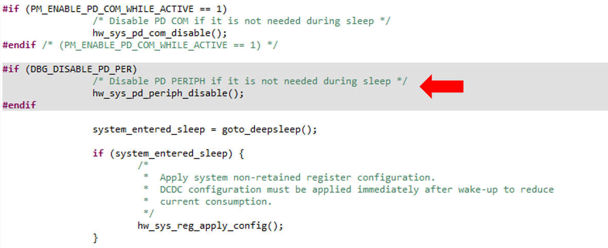
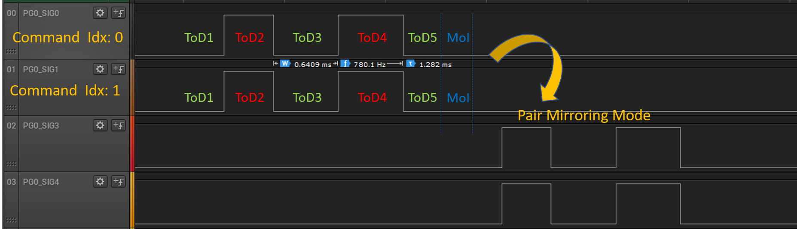
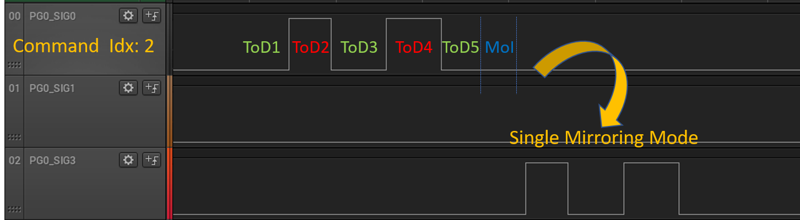
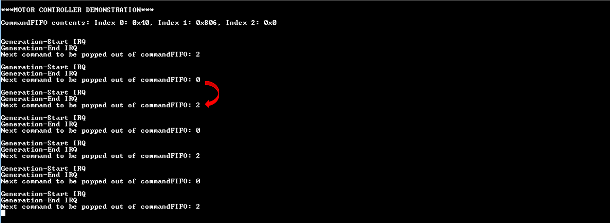

# Step Motor Demonstration

## Example description

This application demonstrates the step motor controller which is responsible for driving motors used to move the hands in a watch. The hardware block consists of five independent 4-signal Pattern Generators (PG) that can be used freely by the developer. All motor signals are mapped on dedicated GPIO pins on the chip. Please note that only the DA14699 SoC incorporates the motor controller. For more information please refer to the datasheet. This example loads arbitrary waveforms in to the wave memory space. The latter, is used for storing the different user-defined waveforms that should be generated by the motor controller. For this example, PG #0 is utilized. In addition, the mirroring mode of the controller is demonstrated. There are two mirroring modes:

- **Single mode:** `PGx_SIG0` signal is replicated on `PGx_SIG2` pin after the execution of Motor Idle (MoI) time
- **Pair mode:** `PGx_SIG0` and `PGx_SIG1` signals are  replicated on `PGx_SIG2` and `PGx_SIG3` pins respectively.

The motor controller is powered by the peripheral power domain (`PD_PER`) and also requires the comms power domain (`PD_COM`) to be up and running to output waves via GPIO pins. By default, when the AMR M33 core is in sleep mode both *PD_PER* and *PD_COM* are switched  off. There are different possible shemes that can be invoked to enable the aforementioned power domains. For this example, *PD_PER* is remained active during sleep time whilst, *PD_COM* is activated through the Sensor Node Controller. Not turning off the *PD_PER* means that there is no need for the motor controller to be reconfigured from the scratch following a wakeup cycle. Please note that the motor registers will lose their contents while in sleep mode.

The sequence of the events required to trigger the motor controller (using the aforementioned scheme) is the following:

1. A periodic RTC event is produced and triggers the Sensor Node Controller (SNC)
1. By enabling the SNC, the *PD_COM* is enabled since the SNC is the master of this power domain
1. A uCode-Block is executed by the SNC scheduler to configure/latch the GPIO pins used by the motor controller. Then, the code triggers the motor controller manually and one or more commands are popped out of the command FIFO
1. Following a motor event (e.g. the completion of a wave) the ARM M33 is notified by the PDC in order to wake up and handle that motor event.

### HW & SW Configurations

- **Hardware Configurations**
  - This example runs on a DA14699 Bluetooth Smart SoC.
  - A DA1469x Pro DevKit is needed for this example.
- **Software Configurations**
  - Download the latest SDK version (10.0.10.x)
  - Smartsnippets Studio V2.0.14 or greater.
  - **SEGGER's J-Link** tools should be downloaded and installed.

## How to run the example

### Initial Setup

- Before running the code the `PD_PER` should be configured to stay active during ARM M33 sleep. This can be achieved by modifying the following code line in `apply_wifi()`, located in `sdk\sys_man\sys_power_mgr_da1469x.c`.

- Download the source code from the Support Website.
- Import the project into your workspace.
- Connect the target device to your host PC.
- Compile the code (either in Release or Debug mode) and load it into the chip.
- Open a serial terminal (115200/8 - N - 1)
- Press the RESET button on DevKit to start executing the application.

Use a logic analyzer to monitor the waves produced on `HW_GPIO_PIN_26`, `HW_GPIO_PIN_27`, `HW_GPIO_PIN_28`, `HW_GPIO_PIN_29`pins. For more information on the target GPIO pins please refer to `config/peripheral_setup.h`. With the mirroring mode enabled, you should expect to get the following output:

&#160;

The serial console prints various debugging messages. The user is free to register callback functions for different motor events (motor IRQs). The value of `N_CMDs` bit field of the first command, that is `command_0` is set to **1**. This means that two consecutive commands will be popped out of the commandFIFO at one motor trigger event. This is why the read pointer of the commandFIFO is incremented by two.

&#160;

**Note:** Motor `slots` are produced via the low power (LP) clock used. By default, this is the `XTAL32K`. After a POR event, it takes ~8 seconds for the XTAL32K to settle and thus, variations in the produced waves might be observed. After 8 seconds of settling the motor controller will generate stable waves.

## Known Limitations

There are no known limitations for this application.
