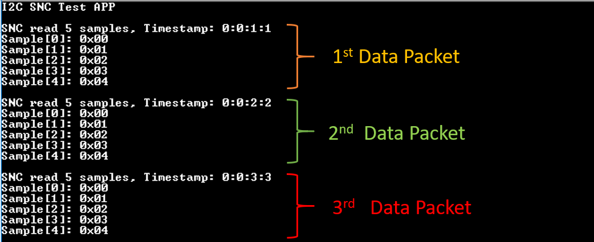
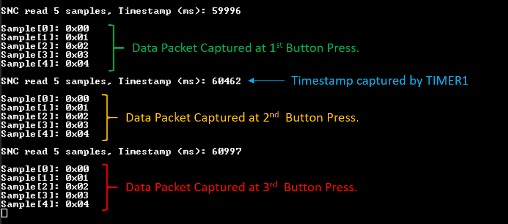

# Template for I2C operations via Sensor Node Controller (SNC)

## Example description

This application demonstrates a template that should be used for performing I2C operations via SNC. The SNC is a sophisticated hardware state machine implementing a very short list of custom instructions. Its key purpose is to read data from externally connected devices following an event, without invoking the ARM M33 which is the main system core. Thus, saving valuable MIPS and reducing the total power consumption. As soon as the SNC has collected all the required data, it notifies the CM33 core to start processing the data. The communication between the CM33 and SNC is achieved through special queues. The current SDK exhibits two types of queues: an `SNC-to-CM33` queue for exchanging data from SNC to CM33 core and an `CM33-to-SNC` for exchanging data from CM33 to SNC. The latter is not used for the majority of the use cases and so, it is not demonstrated.

The application provides all the functionality required for initializing the SNC as well as the Power Domain Controller (PDC) which is responsible for powering the various hardware blocks of the chip. However, the user should provide their own configurations in order to customize the application. In specific:

1. In `main.c` file, declare the code (if needed) that initializes all the externally connected I2C devices. This should be done within M33 context and not within SNC context. See TAG `EXTERNAL_DEVICE_INITIALIZATION`. In the same file declare the code that pops out and processes data from the SNC-to-CM33 queue. See TAG `PROCESSING_DATA`.

2. In `config\platform_devices.c` and  `config\platform_devices.h` files, declare drivers for all the externally connected I2C devices. A device configuration named `I2C_CUSTOM_DEVICE` has already been declared and can be used by the developer.

3. In `config\peripheral_setup.h` file, declare all the GPIO pins used by the application. The developer can use the default configurations.

4. In `snc_i2c_demo\snc_i2c_ucodes.c` file, declare the SNC code that should be executed in case the SNC-to-CM33 queue is full. See TAG `SNC_QUEUE_IS_FULL`. This section is optional and depends on the I2C device/module used. In this file, the developer should also declare the SENIs code that performs the actual I2C transactions. See TAG `SNC_I2C_OPERATIONS`. A possible implementation is provided and can be used as a reference.

5. In `config\custom_macros.h` file, use the provided macros to tailor the application according to your needs.

**Note:** A special mechanism for producing data has been implemented and can be used for verifying the correct behavior of the code (by default enabled). What this mechanism does is to produce fake data just like they would be read from an external I2C devices.

### HW & SW Configurations

- **Hardware Configurations**

  - This example runs on a DA1469x Bluetooth Smart SoC.
  - A DA1469x Pro Development Kit is needed for this example.

- **Software Configurations**

  - Download the latest SDK version for the DA1469x family of devices (10.0.4.x)
  - **SEGGER's J-Link** tools should be downloaded and installed.

## How to run the example

### Initial Setup

- Download the source code from the Support Website.
- Import the project into your workspace.
- Connect the target device to your host PC.
- Compile the code (either in Release or Debug mode) and load it into the chip.
- Open a serial terminal (115200/8 - N - 1)
- Press the reset button on DevKit to start executing the application.

Here is the default setup of the target application: the SNC is triggered following an RTC event produced every 1 second. At each SNC trigger the registered uCode-Block is executed and 5 data samples, each 8-bit in size, are being read via the I2C interface. The read data are being pushed into an SNC-to-CM33 queue. The uCode-Block should be executed three times before notifying the ARM M33 core to start popping/reading data from the queue. Thus, every 3 seconds you should expect to get the following output on the serial console:

&nbsp;

- In `config\custom_macros.h` file, perform the following modifications:
  `#define USER_SNC_TRIGGER_ON_RTC_EVENT             (0)`
  `#define USER_SNC_TRIGGER_ON_WKUP_EVENT            (1)`

- Build the code again, download the firmware in the chip and press the reset button on DevKit.
- Press the **KEY1** button on Pro DevKit three times. You should expect to get the following output on the serial console:

 &nbsp;

The data packets can be distinguished using the timestamp functionality. When the selected PDC trigger source is the RTC, the timestamp value is acquired by the RTC counter (default values are set to zero). When the PDC is triggered by external events then the timestamp value is acquired by the TIMER1 capture counter.

## Known Limitations

There are no known limitations for this application.
